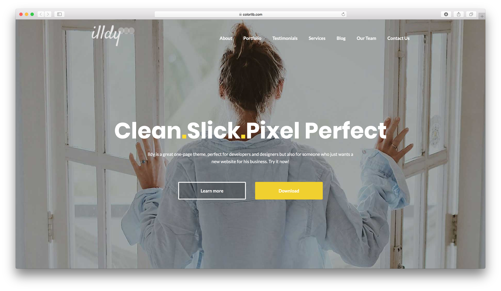

# Desafío 016 - Wordpress


### INSTRUCCIONES:

- Para poder realizar este actividad debes haber realizado los cursos previos junto con los videos online correspondientes a la experiencia 15 y 16.
- Realiza tu trabajo y súbelos a tu repositorio de Github. En este caso es necesario que subas la carpeta `wp-content` y base de datos con extensión`.sql`.
- Luego de pusheados los últimos cambios, sube el link de Github en el desafío de la sección correspondiente en la plataforma.

***

### DESCRIPCIÓN DE ACTIVIDAD

Un connotado coach digital te pide que le hagas su landing page promocional de sus servicios. El connotado coach digital se enamoró del tema [Illdy](https://colorlib.com/wp/themes/illdy/) por lo tanto debes trabajar con él para darle en el gusto.

Para la realización de este trabajo necesitas realizar la configuración inicial del tema Illdy.

 
Tu tarea es editar el contenido para que quede acorde a lo que ofrece tu cliente como servicio. Además, debes configurar el menú de forma que éste haga scroll a las diferentes secciones del landing page. Además se te pide agregar por lo menos 3 entradas, configurar un formulario que se vea dentro de la sección #contact-us y que los botones del jumbotron linkeen a la página blog y a la sección de contacto. Debes personalizar el tema para darle un diseño diferente al que tiene por defecto en la front-page y en el blog-page a través de la personalización de Wordpress.

Todo esto lo puedes lograr siguiendo las instrucciones de la [documentación de Illdy](https://colorlib.com/wp/support/illdy/).

Aquí te damos un ejemplo de cómo podría quedar la landing:

### REQUERIMIENTOS

- El sitio debe tener instalado el tema Illdy.

- Tener hecha configuración inicial del tema Illdy.

- Instalar los plugins sugeridos por el tema.

- Creación y configuración de menú.

- Publicación de 3 entradas.

- Configurar formulario de [Contact Form 7](https://cl.wordpress.org/plugins/contact-form-7/) visible en sección #contact-us.

- Editar los botones del jumbotron para que linkeen a la página blog y a la sección de contacto.

- Personalizar el sitio con imágenes y colores diferentes a la que entrega el tema por defecto.

- La carpeta `wp-content` y [base de datos con extensión`.sql`](https://cl.godaddy.com/help/exportar-mis-bases-de-datos-mysql-1487) deben estar subidas a Github.

### RECURSOS

 - En el siguiente repositorio puedes encontrar las imágenes.

 - Esta es la [documentación del tema Illdy](https://colorlib.com/wp/support/illdy/). Te ayudará bastante en la configuración de diseño y la estructura.

Éxito, ¡vamos con todo!